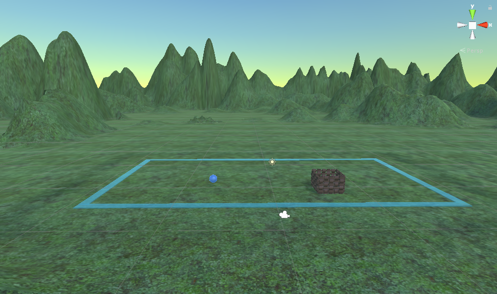

# MysticArts101

### Description
This is the second project for the CS375 course at SEMO.
In this game, the player will need to concentrate to move a ball into a basket.
Sounds easy enough... right?

### Purpose
This project is essentially an experiment for using an EEG device inside of Unity.
I went with the Neurosky Mindwave Mobile since it's wireless and more has a price point that makes it more accessible.
In this game the player will have to concentrate to keep their focus levels up.
Increasing focus makes the ball float higher into the air.
The player can also use the triggers on their VR controllers to push/pull the ball towards them.
Pushing and pulling only works while focus is maintained.
All the player has to do is make the ball float up and then guide it into the basket.

##### The first level. No disctractions, just a calm scenery and the task at hand.

### Specs
- Unity 2018.2.12f1
- SteamVR Plugin 2.0.1
- Neurosky Mindwave
- Oculus Rift
